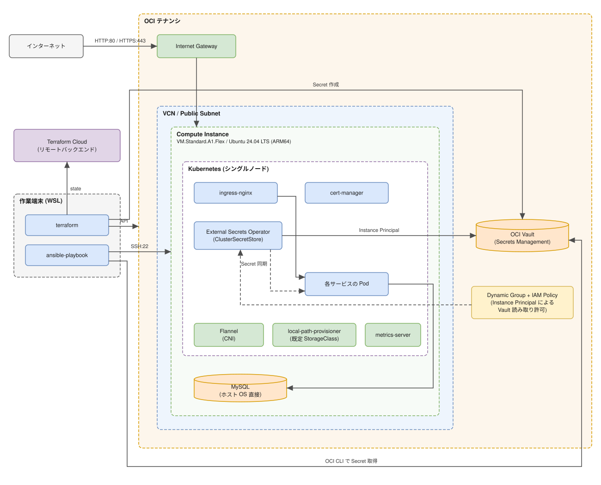

# 1章_基本設計書_システム構成

## 目次

- [1.1. 設計方針](#11-設計方針)
- [1.2. システム構成全体像](#12-システム構成全体像)
- [1.3. 管理レイヤー構成](#13-管理レイヤー構成)
- [1.4. 環境一覧](#14-環境一覧)
- [1.5. 技術スタック](#15-技術スタック)
- [1.6. 関連ドキュメント](#16-関連ドキュメント)

## 1.1. 設計方針

本基盤は、複数の個人開発サービスを 1 台のサーバへ集約して公開するための共通基盤である。
[要件定義書](../../01.requirements/REQUIREMENTS.md) を満たすため、以下を設計原則とする。

- **無償枠内での構築**: OCI（Oracle Cloud Infrastructure）の Always Free 枠の範囲で構成し、
  ランニングコストを発生させない
- **全構成のコード化**: インフラから OS・ミドルウェアまでを Terraform / Ansible のコードで管理し、
  環境を何度でも同じ状態に再構築できる状態を保つ
- **サービスの集約**: Kubernetes をアプリケーションの実行基盤とし、
  サービスの追加時にサーバを増やさない構成とする
- **冗長化よりも再構築**: 単一インスタンス構成を前提とし、
  可用性はハードウェアの冗長化ではなくコードからの再構築で担保する
  （[5章 耐障害性](../05.availability/5章_基本設計書_耐障害性.md)）

## 1.2. システム構成全体像

本基盤の全体像を以下に示す。図の原本は
[別紙_システム構成図](../99.appendix/別紙_システム構成図.drawio.svg) であり、
draw.io で直接編集できる形式（`.drawio.svg`）で管理する。

## 1.3. 管理レイヤー構成

インフラのライフサイクルを 2 層に分け、層ごとに管理ツールを分離する。
境界は「インスタンスが起動するまで」を Terraform、「インスタンスの中身」を Ansible とする。

| 層 | 管理ツール | 管理対象 | ディレクトリ |
| -- | ---------- | -------- | ------------ |
| インフラ層 | Terraform | VCN、サブネット、セキュリティ・リスト、Compute インスタンス、OCI Vault、IAM の動的グループ・ポリシー | `terraform/` |
| 構成管理層 | Ansible | OS 設定、Kubernetes、MySQL | `ansible/` |

Terraform に付随する cloud-init は、Ansible が SSH で接続できる状態を作るための
最小限の初期化（タイムゾーン設定、管理ユーザーの作成、SSH 公開鍵の登録）に留める。
ミドルウェア以降の構成は Ansible へ委譲し、初期化処理を二重に持たない。

各層の実行方式は [8章 基盤制御](../08.platform-control/8章_基本設計書_基盤制御.md) で扱う。

## 1.4. 環境一覧

| 環境 | 用途 | 構成 |
| ---- | ---- | ---- |
| 本番環境 | 個人開発サービスの公開・稼働 | Compute インスタンス × 1（単一リージョン・単一可用性ドメイン） |

検証環境・ステージング環境は設けない。Always Free 枠の範囲に収めることを優先し、
変更は本番環境に対して直接適用する。適用前の影響確認は
[8章 基盤制御](../08.platform-control/8章_基本設計書_基盤制御.md) の実行方式で担保する。

## 1.5. 技術スタック

### 1.5.1. バージョン確定方針

- OS は長期サポート版（LTS）を採用し、Always Free 枠の ARM シェイプで動作するものを選定する
- Kubernetes は `apt` のパッケージバージョンを固定（pin）し、意図しないアップグレードを防ぐ
- Terraform Provider はメジャーバージョンを固定し、マイナーバージョンの更新のみ許容する
- Kubernetes のアドオンは、適用するマニフェストの URL にリリースタグを指定して固定する。
  `latest` / `master` など、取得時点で内容が変わる参照を用いない
- OS の標準リポジトリが提供するミドルウェアは、個別にバージョンを固定せず
  ディストリビューションの提供版に追従する

### 1.5.2. 採用ソフトウェア

| 分類 | 製品・ライブラリ | バージョン |
| ---- | ---------------- | ---------- |
| OS | Ubuntu | 24.04 LTS (ARM64) |
| IaC | Terraform | 1.0.0 以上 |
| Terraform Provider | `oracle/oci` | 5.x |
| 構成管理 | Ansible | 2.15 以上 |
| コンテナランタイム | containerd | Ubuntu 24.04 の apt 提供版 |
| コンテナオーケストレーション | Kubernetes | 1.30 |
| コンテナネットワーク (CNI) | Flannel | v0.28.9 |
| ストレージ (既定 StorageClass) | local-path-provisioner | v0.0.37 |
| リソースメトリクス | metrics-server | v0.9.0 |
| Ingress Controller | ingress-nginx | controller-v1.10.1 |
| 証明書管理 | cert-manager | v1.14.5 |
| データベース | MySQL | Ubuntu 24.04 の apt 提供版 |
| シークレット管理 | OCI Vault（Secrets Management） | DEFAULT Vault / ソフトウェア鍵 |
| シークレット同期 | External Secrets Operator | v2.9.0 |

## 1.6. 関連ドキュメント

| 分類 | ドキュメント |
| ---- | ------------ |
| 要件定義 | [要件定義書](../../01.requirements/REQUIREMENTS.md) |
| 基本設計 | [2章 ネットワーク設計](../02.network/2章_基本設計書_ネットワーク設計.md) |
| 基本設計 | [3章 サーバ構成](../03.server/3章_基本設計書_サーバ構成.md) |
| 基本設計 | [4章 性能・拡張](../04.performance/4章_基本設計書_性能・拡張.md) |
| 基本設計 | [5章 耐障害性](../05.availability/5章_基本設計書_耐障害性.md) |
| 基本設計 | [6章 セキュリティ設計](../06.security/6章_基本設計書_セキュリティ設計.md) |
| 基本設計 | [7章 アカウント管理](../07.account/7章_基本設計書_アカウント管理.md) |
| 基本設計 | [8章 基盤制御](../08.platform-control/8章_基本設計書_基盤制御.md) |
| 基本設計 | [9章 監視・ログ設計](../09.monitoring/9章_基本設計書_監視・ログ設計.md) |
| 基本設計 | [10章 バックアップ・リストア設計](../10.backup/10章_基本設計書_バックアップ・リストア設計.md) |
| 基本設計 | [11章 ライフサイクル管理方式](../11.lifecycle/11章_基本設計書_ライフサイクル管理方式.md) |
| 詳細設計 | [OS詳細設計書](../../03.detailed-design/OS詳細設計書.md) |
| 詳細設計 | [Kubernetes詳細設計書](../../03.detailed-design/Kubernetes詳細設計書.md) |
| 詳細設計 | [MySQL詳細設計書](../../03.detailed-design/MySQL詳細設計書.md) |
| 構築手順 | [Terraform Cloud セットアップ](../../04.build/01_TerraformCloudセットアップ.md) |
| 構築手順 | [SSH 接続手順](../../04.build/02_SSH接続手順.md) |
| 構築手順 | [Ansible によるサーバ構成管理](../../04.build/03_Ansibleによるサーバ構成管理.md) |
