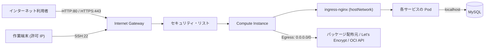

# 2章_基本設計書_ネットワーク設計

## 目次

- [2.1. 設計方針](#21-設計方針)
- [2.2. VCN・サブネット構成](#22-vcnサブネット構成)
- [2.3. ルーティング設計](#23-ルーティング設計)
- [2.4. 通信制御設計](#24-通信制御設計)
- [2.5. 通信フロー](#25-通信フロー)
- [2.6. 名前解決・DNS](#26-名前解決dns)

## 2.1. 設計方針

- **単一サブネット構成**: 稼働するインスタンスが 1 台であるため、ネットワーク階層を多層化せず
  Public Subnet 1 本で構成する。NAT Gateway・Service Gateway は使用しない（Always Free 枠の
  構成を単純に保ち、課金要素を持ち込まないため）
- **通信制御の一元化**: 受信制御は OCI のセキュリティ・リストで一元管理し、
  OS 内のパケットフィルタは使用しない。制御点を 1 箇所に集約し、設定の二重管理を避ける
- **公開経路の最小化**: インターネットへ開放するのは Web 公開に必要なポートに限定し、
  運用経路（SSH）は接続元 IP で限定する

## 2.2. VCN・サブネット構成

| 項目 | 設計 |
| ---- | ---- |
| VCN | 1 個。CIDR は Terraform の変数で管理する |
| サブネット | Public Subnet × 1。パブリック IP の割り当てを許可する |
| Internet Gateway | 1 個。VCN とインターネットの境界とする |
| 可用性ドメイン | 単一（[5章 耐障害性](../05.availability/5章_基本設計書_耐障害性.md)） |

インスタンスには起動時にパブリック IP を自動割り当てし、インターネットからの受信と
インスタンスからの送信の双方を同一の経路で扱う。

## 2.3. ルーティング設計

| 宛先 | 経路 |
| ---- | ---- |
| `0.0.0.0/0`（デフォルトルート） | Internet Gateway |
| VCN 内 | VCN のローカルルーティング（暗黙） |

オンプレミス・他クラウドとの接続は行わないため、VPN・FastConnect は使用しない。

## 2.4. 通信制御設計

セキュリティ・リストで、以下の方針により通信を制御する。
具体的なポート番号・許可 CIDR は Terraform の変数で管理する。

| 方向 | 方針 |
| ---- | ---- |
| Ingress（受信） | Web 公開用の HTTP / HTTPS はインターネット全体から許可する。運用管理用の SSH は許可した接続元 IP からのみ許可する。疎通確認のため ICMP を許可する |
| Egress（送信） | すべての宛先を許可する。パッケージ取得・証明書発行・コンテナイメージ取得など外部依存が多岐にわたるため、宛先による制限は行わない |

ステートフルルールを使用し、戻り通信のための逆方向ルールは定義しない。
セキュリティ上の位置付けは [6章 セキュリティ設計](../06.security/6章_基本設計書_セキュリティ設計.md) で扱う。

## 2.5. 通信フロー

- 外部から到達するのは Ingress Controller が待ち受ける HTTP / HTTPS と、運用用の SSH に限られる
- アプリケーションから MySQL への接続はインスタンス内のループバック経由とし、
  データベースをネットワークへ公開しない（[3章 サーバ構成](../03.server/3章_基本設計書_サーバ構成.md)）

## 2.6. 名前解決・DNS

| 対象 | 設計 |
| ---- | ---- |
| VCN 内の名前解決 | OCI の VCN Resolver を使用する |
| 公開サービスのドメイン | 外部の DNS サービスで管理し、インスタンスのパブリック IP を指す A レコードを登録する。本リポジトリの管理対象外とする |
| サーバ証明書 | cert-manager が公開ドメインに対して Let's Encrypt から自動取得する（[6章 セキュリティ設計](../06.security/6章_基本設計書_セキュリティ設計.md)） |

インスタンスの OS 内部における名前解決・ホスト名の扱いは
[OS詳細設計書](../../03.detailed-design/OS詳細設計書.md) で扱う。
