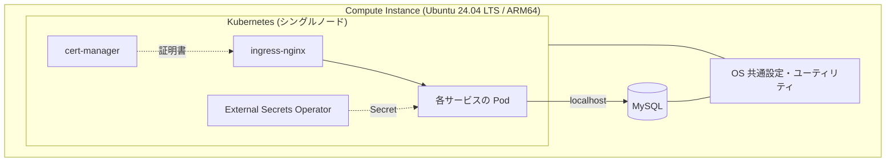

# 3章_基本設計書_サーバ構成

## 目次

- [3.1. 設計方針](#31-設計方針)
- [3.2. Compute インスタンス設計](#32-compute-インスタンス設計)
- [3.3. OS 設計](#33-os-設計)
- [3.4. Kubernetes 基盤設計](#34-kubernetes-基盤設計)
- [3.5. データベース設計](#35-データベース設計)
- [3.6. サーバ内コンポーネント構成](#36-サーバ内コンポーネント構成)

## 3.1. 設計方針

- **1 台への集約**: サービスごとにサーバを分けず、1 台の Compute インスタンス上に
  Kubernetes とデータベースを同居させる
- **実行基盤はコンテナ、データストアはホスト**: アプリケーションは Kubernetes 上の Pod として
  稼働させ、永続データを持つ MySQL はホスト OS へ直接導入する。
  シングルノード構成ではコンテナ化しても可用性が向上せず、
  永続ボリュームの管理が増えるだけであるため
- **ディストリビューション標準の優先**: ミドルウェアは原則として OS の標準リポジトリから導入し、
  独自ビルド・サードパーティリポジトリへの依存を最小化する

## 3.2. Compute インスタンス設計

| 項目 | 設計 |
| ---- | ---- |
| シェイプ | `VM.Standard.A1.Flex`（ARM64、Always Free 枠） |
| 割り当てリソース | 4 OCPU / 24 GB RAM（[4章 性能・拡張](../04.performance/4章_基本設計書_性能・拡張.md)） |
| OS イメージ | Ubuntu 24.04 LTS (ARM64) |
| ブートボリューム | 200 GB（Always Free 枠の上限） |
| 配置 | Public Subnet。パブリック IP を自動割り当て |
| 初期化 | cloud-init によりタイムゾーン設定・管理ユーザー作成・SSH 公開鍵登録を行う |
| Oracle Cloud Agent | 管理プラグイン・監視プラグインを有効化し、Bastion プラグインは無効化する |

インスタンスは Terraform の削除保護の対象とし、
ブートボリュームごと破棄される操作を誤って実行できないようにする。
OS イメージの更新はインスタンスの再作成を伴うため、
稼働中インスタンスへは反映せず [11章 ライフサイクル管理方式](../11.lifecycle/11章_基本設計書_ライフサイクル管理方式.md)
の方針に従う。

## 3.3. OS 設計

| 項目 | 設計 |
| ---- | ---- |
| ディストリビューション | Ubuntu 24.04 LTS (ARM64) |
| 構成管理 | Ansible の `os` ロールで、システム共通設定・パッケージ管理・ユーザー管理・堅牢化を適用する |
| タイムゾーン | `Asia/Tokyo` |
| パケットフィルタ | OS 内では使用しない（[2章 ネットワーク設計](../02.network/2章_基本設計書_ネットワーク設計.md)） |

パラメータ単位の設定値は [OS詳細設計書](../../03.detailed-design/OS詳細設計書.md) で扱う。

## 3.4. Kubernetes 基盤設計

| 項目 | 設計 |
| ---- | ---- |
| クラスター構成 | シングルノード。コントロールプレーンのノードでワークロードも実行する |
| コンテナランタイム | containerd |
| CNI | Pod ネットワークを提供する CNI プラグインを導入する |
| Ingress Controller | `ingress-nginx`。ノードの 80 / 443 で受信し、ホスト名・パスでサービスへ振り分ける |
| 証明書管理 | `cert-manager`。ClusterIssuer（ACME）により Let's Encrypt の証明書を自動発行・更新する |
| シークレット同期 | External Secrets Operator。OCI Vault の Secret を Kubernetes Secret へ同期する |
| 構成管理 | Ansible の `kubernetes` ロールで導入・設定する |

クラスターに載せる各サービスのマニフェストは本リポジトリのスコープ外とし、
アプリケーション側のリポジトリで管理する。
クラスター内部の構成は [Kubernetes詳細設計書](../../03.detailed-design/Kubernetes詳細設計書.md) で扱う。

## 3.5. データベース設計

| 項目 | 設計 |
| ---- | ---- |
| 製品 | MySQL（Ubuntu 標準リポジトリの提供版） |
| 配置 | ホスト OS へ直接導入し、ループバックアドレスでのみ待ち受ける |
| 論理分割 | サービスごとにスキーマを分離し、相互のスキーマへ直接アクセスしない |
| 文字コード | `utf8mb4` を標準とする |
| 接続情報 | OCI Vault を真実源とし、Kubernetes へは External Secrets Operator 経由で配布する（[6章 セキュリティ設計](../06.security/6章_基本設計書_セキュリティ設計.md)） |
| 構成管理 | Ansible の `mysql` ロールで導入・設定する |

各サービスのテーブル定義はアプリケーション側のリポジトリで管理し、本リポジトリでは扱わない。
パラメータ・権限モデルの詳細は [MySQL詳細設計書](../../03.detailed-design/MySQL詳細設計書.md) で扱う。

## 3.6. サーバ内コンポーネント構成

