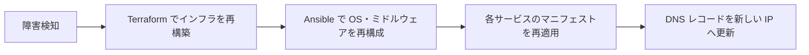

# 5章_基本設計書_耐障害性

## 目次

- [5.1. 設計方針](#51-設計方針)
- [5.2. 冗長化方針](#52-冗長化方針)
- [5.3. 単一障害点](#53-単一障害点)
- [5.4. 障害時の復旧方式](#54-障害時の復旧方式)

## 5.1. 設計方針

- **冗長化を行わない**: 個人開発基盤であり、サービス停止が業務影響を持たないため、
  コストと構成の単純さを優先して単一構成とする
- **復旧手段をコードで保証する**: 冗長化しない代わりに、
  Terraform / Ansible のコードから同じ環境を再構築できる状態を常に維持する
- **データの喪失可否を明示する**: 再構築で復元できるもの（構成）と、
  再構築では復元できないもの（データベースのデータ）を区別して扱う
  （[10章 バックアップ・リストア設計](../10.backup/10章_基本設計書_バックアップ・リストア設計.md)）

## 5.2. 冗長化方針

| レイヤ | 構成 | 冗長化 |
| ------ | ---- | ------ |
| リージョン | 単一リージョン | なし |
| 可用性ドメイン | 単一 | なし |
| Compute インスタンス | 1 台 | なし |
| Kubernetes | シングルノード（コントロールプレーン兼ワーカー） | なし |
| MySQL | ホスト OS 上に 1 インスタンス | なし（レプリカを構成しない） |

Kubernetes の ReplicaSet による Pod の再起動は同一ノード内で完結するため、
ノード障害に対する冗長性は持たない。

## 5.3. 単一障害点

以下はいずれも単一障害点であり、構成上これを許容する。

| 単一障害点 | 影響 | 許容理由 |
| ---------- | ---- | -------- |
| Compute インスタンス | 全サービスの停止 | 冗長化には追加インスタンスが必要で、Always Free 枠を超えるため |
| ブートボリューム | 全サービスの停止とデータ喪失 | 同上。復旧は再構築で行う |
| 可用性ドメイン・リージョン | 全サービスの停止 | 個人開発基盤として災害対策は要件としない |
| パブリック IP | 公開サービスへ到達不能 | インスタンス再作成時は DNS のレコード更新で対応する |

## 5.4. 障害時の復旧方式

復旧はコードからの再構築を基本とし、以下の順で実施する。

| 対象 | 復旧手段 | 復旧できる範囲 |
| ---- | -------- | -------------- |
| インフラ構成 | Terraform の再適用 | コードに定義された構成すべて |
| OS・ミドルウェア構成 | Ansible の再適用 | コードに定義された構成すべて |
| 各サービス | アプリケーション側リポジトリのマニフェスト適用 | 各サービスの稼働状態 |
| データベースのデータ | [10章 バックアップ・リストア設計](../10.backup/10章_基本設計書_バックアップ・リストア設計.md) に従う | 取得済みのダンプの範囲 |

目標復旧時間（RTO）・目標復旧時点（RPO）は数値目標を定めず、
再構築が完了した時点を復旧とみなす。
