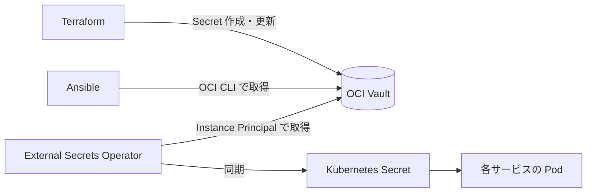

# 6章_基本設計書_セキュリティ設計

## 目次

- [6.1. 設計方針](#61-設計方針)
- [6.2. ネットワークセキュリティ](#62-ネットワークセキュリティ)
- [6.3. サーバへのアクセス制御](#63-サーバへのアクセス制御)
- [6.4. 通信の暗号化と証明書管理](#64-通信の暗号化と証明書管理)
- [6.5. シークレット管理](#65-シークレット管理)
- [6.6. OS 堅牢化・脆弱性対策](#66-os-堅牢化脆弱性対策)

**本章のスコープ外**: 利用者アカウントと権限の設計は
[7章 アカウント管理](../07.account/7章_基本設計書_アカウント管理.md)、
パッチ適用のサイクルは
[11章 ライフサイクル管理方式](../11.lifecycle/11章_基本設計書_ライフサイクル管理方式.md) で扱う。

## 6.1. 設計方針

- **公開面の最小化**: インターネットへ公開するのは Web の受信ポートのみとし、
  運用経路は接続元 IP で限定する
- **秘密情報をコードに置かない**: パスワード・鍵・接続情報はリポジトリへ平文で保存せず、
  用途ごとに定めた保管先から実行時に取得する
- **真実源の一元化**: 複数のプロジェクトで共有する接続情報は OCI Vault を唯一の真実源とし、
  各プロジェクトの設定ファイルへ書き写す運用を行わない
- **多層に分散させない**: 通信制御はクラウド側の 1 層に集約し、
  OS 内に二重の制御点を持たない（誤設定による疎通不能と設定漏れの双方を避けるため）

## 6.2. ネットワークセキュリティ

| 対象 | 方針 |
| ---- | ---- |
| 受信制御 | OCI のセキュリティ・リストで一元管理する（[2章 ネットワーク設計](../02.network/2章_基本設計書_ネットワーク設計.md)） |
| 公開ポート | Web 公開用の HTTP / HTTPS のみインターネットへ開放する |
| 運用ポート | SSH は許可した接続元 IP からのみ許可する |
| OS 内パケットフィルタ | 使用しない。制御点をクラウド側に一本化する |
| データベースの待ち受け | ループバックアドレスに限定し、ネットワークへ公開しない |

## 6.3. サーバへのアクセス制御

| 項目 | 方針 |
| ---- | ---- |
| 接続方式 | SSH（公開鍵認証のみ）。パスワード認証は無効化する |
| 接続元 | セキュリティ・リストで許可した IP のみ |
| 特権操作 | 管理ユーザーから `sudo` で実行する。`root` での直接ログインは行わない |
| 鍵の管理 | 秘密鍵は作業端末のみに保持し、リポジトリへ含めない |

設定値の詳細は [OS詳細設計書](../../03.detailed-design/OS詳細設計書.md) で扱う。

## 6.4. 通信の暗号化と証明書管理

| 区間 | 方式 |
| ---- | ---- |
| 利用者 〜 公開サービス | HTTPS（TLS）。HTTP での受信も許可し、証明書発行の HTTP-01 チャレンジに使用する |
| 作業端末 〜 サーバ | SSH |
| 作業端末 / サーバ 〜 OCI API | HTTPS（OCI SDK・CLI の標準経路） |
| Pod 〜 MySQL | インスタンス内のループバック通信のため暗号化しない |

サーバ証明書は cert-manager の ClusterIssuer（ACME）により Let's Encrypt から自動発行し、
期限前に自動更新する。証明書を手動で配置・更新しない。

## 6.5. シークレット管理

秘密情報は、利用する主体に応じて保管先を使い分ける。

| 保管先 | 対象 | 利用する主体 |
| ------ | ---- | ------------ |
| OCI Vault（Secrets Management） | 個人開発プロジェクト間で共有するデータベース接続情報 | Ansible（OCI CLI 経由）、Kubernetes 上の External Secrets Operator |
| Terraform Cloud の Variable（Sensitive） | OCI API の認証情報など Terraform 実行に必要な値 | Terraform |
| Ansible Vault | Ansible の実行時にのみ必要な値 | Ansible |

- OCI Vault は Always Free 枠に収めるため DEFAULT Vault（ソフトウェア鍵）を使用し、
  HSM 保護モードは使用しない
- Kubernetes への配布は External Secrets Operator が担い、
  Secret のマニフェストに値を直接記述しない
- External Secrets Operator は Instance Principal で Vault を読み取る。
  そのための動的グループとポリシーは
  [7章 アカウント管理](../07.account/7章_基本設計書_アカウント管理.md) で扱う

## 6.6. OS 堅牢化・脆弱性対策

| 項目 | 方針 |
| ---- | ---- |
| OS 堅牢化 | SSH の設定強化、カーネルパラメータの調整、リソース制限を Ansible で適用する |
| セキュリティ更新 | 自動適用の仕組みを有効化する（[11章 ライフサイクル管理方式](../11.lifecycle/11章_基本設計書_ライフサイクル管理方式.md)） |
| 監査・侵入検知 | OS 標準の監査機構を有効化し、ログは journald へ集約する（[9章 監視・ログ設計](../09.monitoring/9章_基本設計書_監視・ログ設計.md)） |
| 脆弱性スキャン | 専用製品は導入しない。ディストリビューションのセキュリティ更新への追従で代替する |

適用する設定値は [OS詳細設計書](../../03.detailed-design/OS詳細設計書.md) で扱う。
