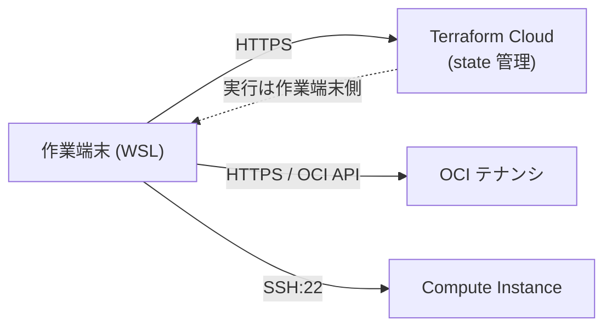
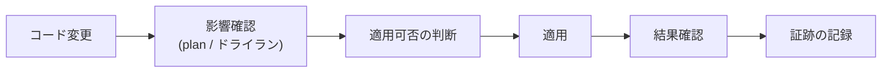

# 8章_基本設計書_基盤制御

## 目次

- [8.1. 設計方針](#81-設計方針)
- [8.2. 操作経路](#82-操作経路)
- [8.3. インフラ層の実行方式（Terraform）](#83-インフラ層の実行方式terraform)
- [8.4. 構成管理層の実行方式（Ansible）](#84-構成管理層の実行方式ansible)
- [8.5. 変更の適用フロー](#85-変更の適用フロー)
- [8.6. 外部インタフェース](#86-外部インタフェース)

## 8.1. 設計方針

- **サーバを直接変更しない**: 設定変更はコードを変更して適用する。
  サーバ上での手作業による変更は、再構築時に失われるため行わない
- **CI/CD を設けない**: 単一環境の個人開発基盤であり、
  適用のたびに人が判断するほうが単純で安全であるため、作業端末から直接適用する
- **適用前に影響を確認する**: 変更の適用前に、必ず実行計画（Terraform）または
  ドライラン（Ansible）で差分を確認する
- **接続先をコードから解決する**: サーバの IP アドレスなど環境に依存する値は
  インフラ層の出力から取得し、構成管理層に固定値として持たせない

## 8.2. 操作経路

| 経路 | 用途 | 認証 |
| ---- | ---- | ---- |
| 作業端末 → OCI API | インフラリソースの作成・変更 | API キー |
| 作業端末 → Terraform Cloud | state の保存・取得 | トークン |
| 作業端末 → インスタンス（SSH） | OS・ミドルウェアの構成、状態確認 | SSH 公開鍵 |

OCI コンソールからの手動操作は、Terraform の管理対象と競合するため原則として行わない。

## 8.3. インフラ層の実行方式（Terraform）

| 項目 | 方式 |
| ---- | ---- |
| ワークフロー | CLI-driven workflow。作業端末から実行する |
| state | Terraform Cloud の Workspace で管理し、ローカルに保持しない |
| 認証情報 | Terraform Cloud の Variable（Sensitive）で保持する |
| 実行単位 | リポジトリの `terraform/` を単一の構成として適用する |
| 削除保護 | インスタンスなど再作成が容易でないリソースは削除保護を設定する |

セットアップ手順は
[Terraform Cloud セットアップ](../../04.build/01_TerraformCloudセットアップ.md) を参照する。

## 8.4. 構成管理層の実行方式（Ansible）

| 項目 | 方式 |
| ---- | ---- |
| 接続方式 | SSH（公開鍵認証） |
| 接続先の解決 | インフラ層の出力（パブリック IP・接続ユーザー等）から実行時に解決する |
| 構成単位 | 役割ごとにロールを分割し、`os` → `kubernetes` → `mysql` の順で適用する |
| 部分適用 | ロールと同名のタグを指定して、ロール単位で適用できる構成とする |
| 冪等性 | すべてのタスクを冪等に記述し、再実行しても状態が変わらないようにする |
| 秘密情報 | Ansible Vault と OCI Vault を使い分ける（[6章 セキュリティ設計](../06.security/6章_基本設計書_セキュリティ設計.md)） |

実行手順は
[Ansible によるサーバ構成管理](../../04.build/03_Ansibleによるサーバ構成管理.md) を参照する。

## 8.5. 変更の適用フロー

| 層 | 影響確認 | 適用 |
| -- | -------- | ---- |
| インフラ層 | 実行計画を取得し、追加・変更・削除の件数と対象リソースを確認する | 確認済みの実行計画を適用する |
| 構成管理層 | ドライランで変更されるタスクを確認する | ドライランなしで適用しない |

- 適用は本番環境へ直接行うため、削除を伴う変更は特に対象リソースを個別に確認する
- サーバ上で実行したコマンドと出力は証跡として記録し、リポジトリの管理対象外に保管する
- リリース単位は「コードの変更単位」とし、
  変更は Pull Request 単位でレビューを経てから適用する

## 8.6. 外部インタフェース

| インタフェース | 内容 |
| -------------- | ---- |
| OCI API | Terraform Provider 経由でリソースを操作する。認証は API キー方式 |
| Terraform Cloud | リモートバックエンドとして state を管理する |
| SSH | 作業端末から許可された IP 経由でインスタンスへ接続する |
| OCI Vault API | Terraform が Secret を作成・更新し、Ansible と External Secrets Operator が読み取る |
| Let's Encrypt（ACME） | cert-manager がサーバ証明書を自動発行・更新する |
| パッケージ配布元 | OS・ミドルウェアのパッケージおよびコンテナイメージを取得する |
