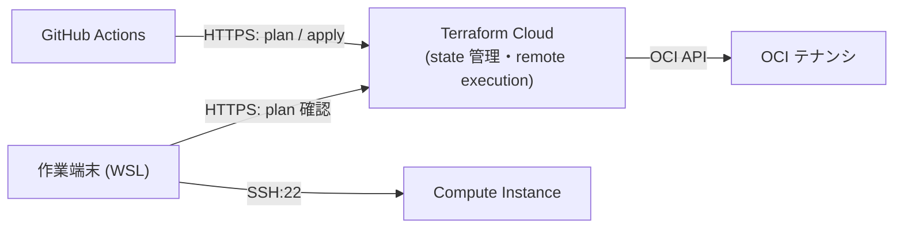
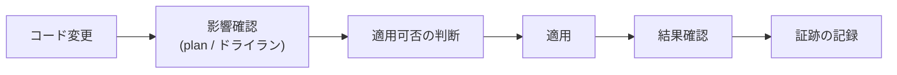

# 8章_基本設計書_基盤制御

## 目次

- [8.1. 設計方針](#81-設計方針)
- [8.2. 操作経路](#82-操作経路)
- [8.3. インフラ層の実行方式（Terraform）](#83-インフラ層の実行方式terraform)
- [8.4. 構成管理層の実行方式（Ansible）](#84-構成管理層の実行方式ansible)
- [8.5. 変更の適用フロー](#85-変更の適用フロー)
- [8.6. 外部インタフェース](#86-外部インタフェース)

## 8.1. 設計方針

- **サーバを直接変更しない**: 設定変更はコードを変更して適用する。
  サーバ上での手作業による変更は、再構築時に失われるため行わない
- **層ごとに適用経路を分ける**: Terraform は Pull Request のレビュー・マージ承認を
  適用可否の判断点とし、CI/CD（GitHub Actions）で自動適用する。Ansible は SSH 接続を
  外部へ開放しない構成のため、当面は作業端末から直接適用する
  （<mark>OCI Bastion 経由での CI/CD 化は今後の対応（[Issue #135](https://github.com/Seiya-Nakagawa/infra-oci/issues/135)）</mark>）
- **適用前に影響を確認する**: 変更の適用前に、必ず実行計画（Terraform）または
  ドライラン（Ansible）で差分を確認する。Terraform は Pull Request 上の CI 実行結果で確認する
- **接続先をコードから解決する**: サーバの IP アドレスなど環境に依存する値は
  インフラ層の出力から取得し、構成管理層に固定値として持たせない

## 8.2. 操作経路

```mermaid
graph LR
    GHA["GitHub Actions"] -->|HTTPS: plan / apply| TFC["Terraform Cloud<br/>(state 管理・remote execution)"]
    TFC -->|OCI API| OCI["OCI テナンシ"]
    OP["作業端末 (WSL)"] -->|HTTPS: plan 確認| TFC
    OP -->|SSH:22| INST["Compute Instance"]
```

| 経路 | 用途 | 認証 |
| ---- | ---- | ---- |
| GitHub Actions → Terraform Cloud | Pull Request で plan、main マージで apply を実行する | Terraform Cloud の API トークン（GitHub Secrets） |
| Terraform Cloud → OCI API | インフラリソースの作成・変更（実行は Terraform Cloud 側で行う） | API キー（Terraform Cloud の Variable） |
| 作業端末 → Terraform Cloud | plan の内容を確認する（ローカルからの apply は行わない） | トークン |
| 作業端末 → インスタンス（SSH） | OS・ミドルウェアの構成、状態確認 | SSH 公開鍵 |

OCI コンソールからの手動操作は、Terraform の管理対象と競合するため原則として行わない。

## 8.3. インフラ層の実行方式（Terraform）

| 項目 | 方式 |
| ---- | ---- |
| ワークフロー | CLI-driven workflow。GitHub Actions から実行する（remote execution のため、実際の処理は Terraform Cloud 側で行われる） |
| state | Terraform Cloud の Workspace で管理し、ローカルに保持しない |
| 認証情報 | OCI の認証情報は Terraform Cloud の Variable（Sensitive）で保持する。GitHub Actions には Terraform Cloud の API トークンのみを Secrets として保持し、OCI の認証情報を複製しない |
| 適用のトリガー | Pull Request の作成・更新で plan、main へのマージで apply を実行する |
| 適用可否の判断 | Pull Request のレビュー・マージ承認をもって判断する（8.5節） |
| 実行単位 | リポジトリの `terraform/` を単一の構成として適用する |
| 削除保護 | データ・バックアップ・機密値を保持するリソース（インスタンス、DB ダンプの保管先バケット、Vault・暗号鍵・シークレット）は削除保護を設定する。マージ後は承認なしで自動適用されるため、誤った削除・置換をコード側で防ぐ |

作業端末から `plan` を実行して内容を確認することはできるが、`apply` は行わない（本番適用は CI/CD 経由に統一する）。

セットアップ手順は
[Terraform Cloud セットアップ](../../04.build/01_TerraformCloudセットアップ.md)、
[GitHub Actions セットアップ](../../04.build/05_GitHubActionsセットアップ.md) を参照する。

## 8.4. 構成管理層の実行方式（Ansible）

| 項目 | 方式 |
| ---- | ---- |
| 接続方式 | SSH（公開鍵認証） |
| 接続先の解決 | インフラ層の出力（パブリック IP・接続ユーザー等）から実行時に解決する |
| 構成単位 | 役割ごとにロールを分割し、`os` → `kubernetes` → `mysql` の順で適用する |
| 部分適用 | ロールと同名のタグを指定して、ロール単位で適用できる構成とする |
| 冪等性 | すべてのタスクを冪等に記述し、再実行しても状態が変わらないようにする |
| 秘密情報 | Ansible Vault と OCI Vault を使い分ける（[6章 セキュリティ設計](../06.security/6章_基本設計書_セキュリティ設計.md)） |

実行手順は
[Ansible によるサーバ構成管理](../../04.build/03_Ansibleによるサーバ構成管理.md) を参照する。

## 8.5. 変更の適用フロー

```mermaid
graph LR
    A["コード変更"] --> B["影響確認<br/>(plan / ドライラン)"]
    B --> C["適用可否の判断"]
    C --> D["適用"]
    D --> E["結果確認"]
    E --> F["証跡の記録"]
```

| 層 | 影響確認 | 適用可否の判断 | 適用 |
| -- | -------- | -------------- | ---- |
| インフラ層（Terraform） | Pull Request 上の CI（GitHub Actions）が実行計画を取得し、追加・変更・削除の件数と対象リソースを確認する | Pull Request のレビュー・マージ承認 | main へのマージを契機に CD（GitHub Actions）が自動適用する |
| 構成管理層（Ansible） | 作業端末でドライランを実行し、変更されるタスクを確認する | 作業者が確認する | 作業端末から適用する。ドライランなしで適用しない |

- 適用は本番環境へ直接行うため、削除を伴う変更は特に対象リソースを個別に確認する。
  Terraform の CI 結果は、コード変更で意図した属性以外の変更（ドリフト）が含まれていないか必ず照合する
- サーバ上で実行したコマンドと出力（Ansible）は証跡として記録し、リポジトリの管理対象外に保管する
- リリース単位は「コードの変更単位」とし、
  変更は Pull Request 単位でレビューを経てから適用する

## 8.6. 外部インタフェース

| インタフェース | 内容 |
| -------------- | ---- |
| GitHub Actions | Pull Request 契機の plan、main マージ契機の apply を実行する CI/CD 基盤 |
| OCI API | Terraform Provider 経由でリソースを操作する。認証は API キー方式 |
| Terraform Cloud | リモートバックエンドとして state を管理し、plan / apply を remote execution で実行する |
| SSH | 作業端末から許可された IP 経由でインスタンスへ接続する |
| OCI Vault API | Terraform が Secret を作成・更新し、Ansible と External Secrets Operator が読み取る |
| Let's Encrypt（ACME） | cert-manager がサーバ証明書を自動発行・更新する |
| パッケージ配布元 | OS・ミドルウェアのパッケージおよびコンテナイメージを取得する |
